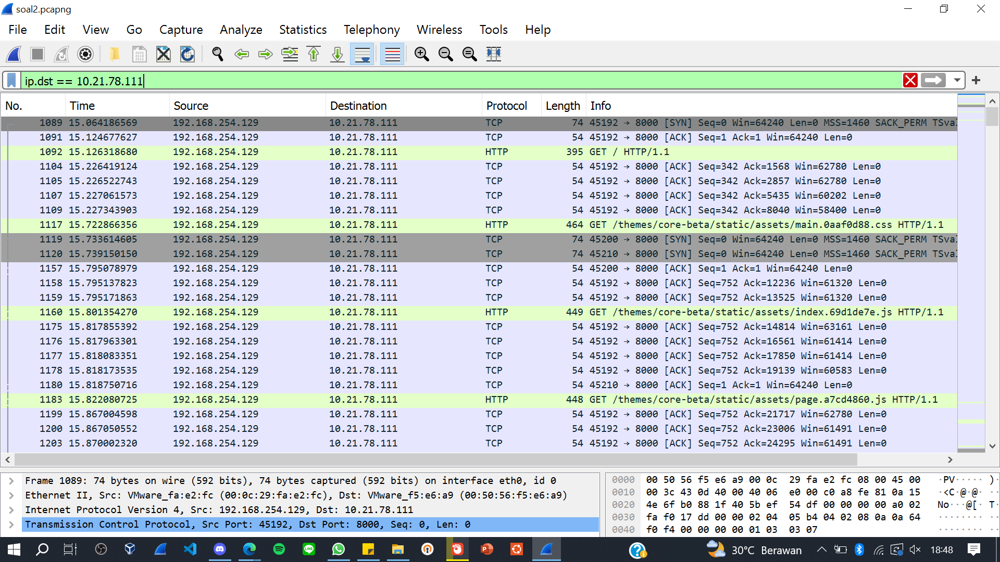
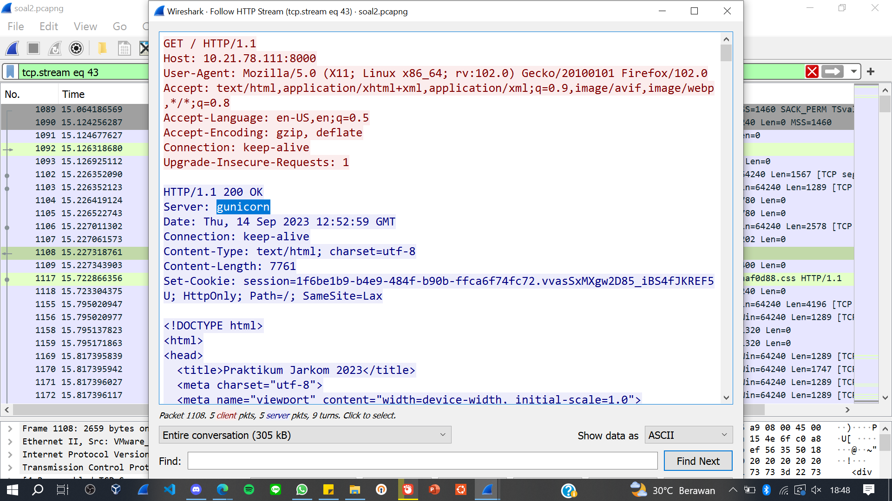
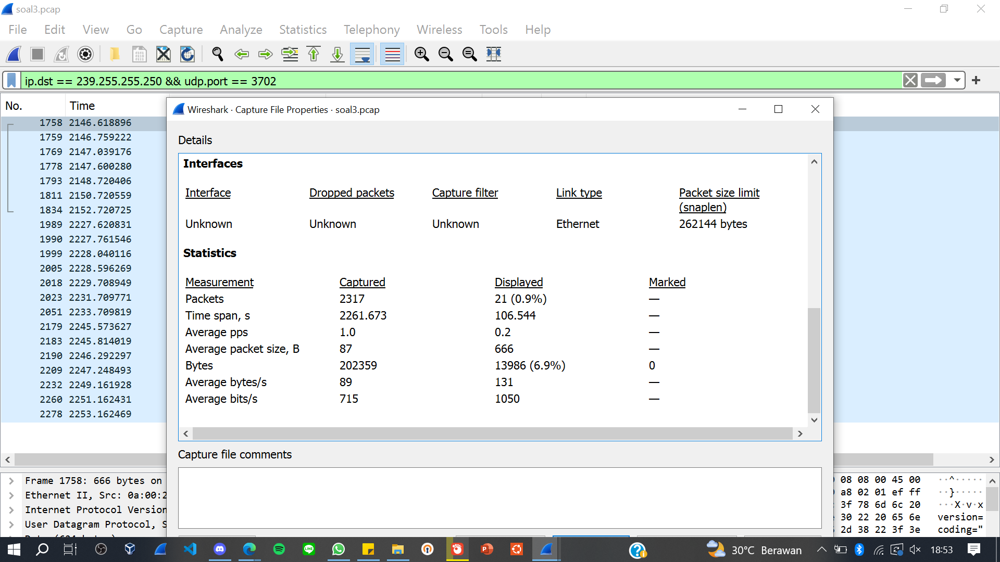
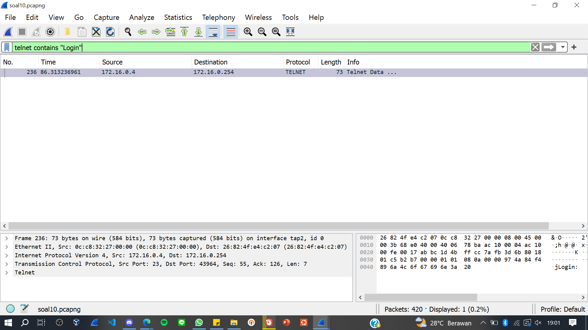
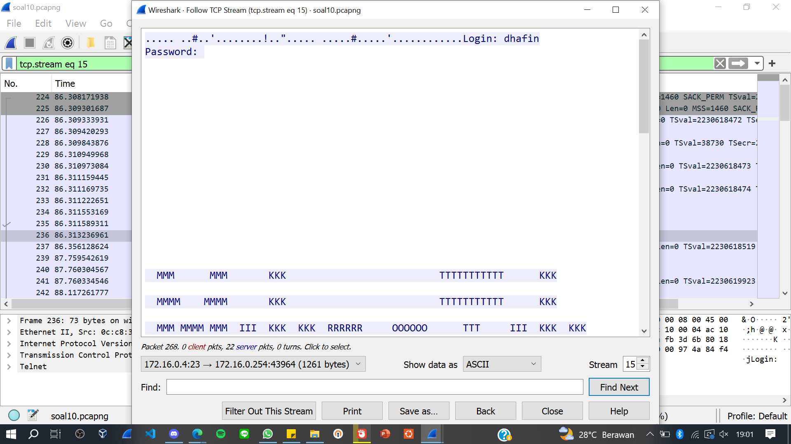
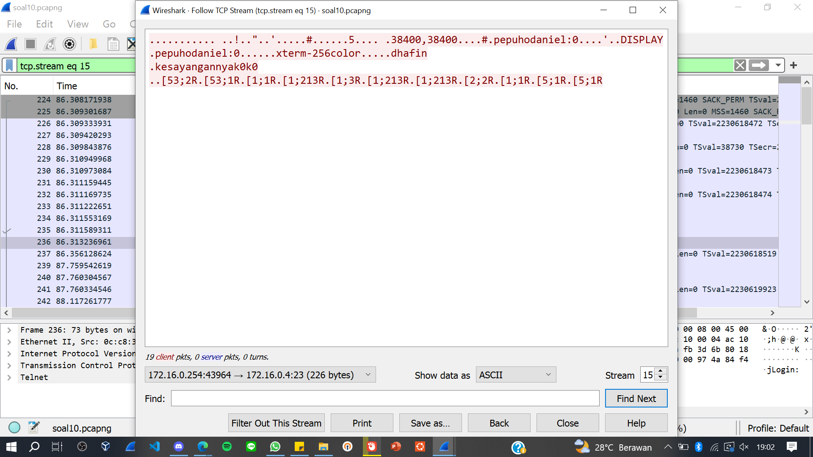

# Jarkom-Modul-1-D02-2023

Nama Anggota | NRP
------------------- | --------------		
Abdurrohim Usaamah Khafizduddin | 5025201255
Ryan Abinugraha | 5025211178

## List of Contents :
- [Soal 1](#soal-1)
	- [Jawaban](#jawaban-soal-1)
- [Soal 2](#soal-2)
	- [Jawaban](#jawaban-soal-2)
- [Soal 3](#soal-3)
	- [Jawaban](#jawaban-soal-3)
- [Soal 4](#soal-4)
	- [Jawaban](#jawaban-soal-4)
- [Soal 5](#soal-5)
	- [Jawaban](#jawaban-soal-5)
- [Soal 6](#soal-6)
	- [Jawaban](#jawaban-soal-6)
- [Soal 7](#soal-7)
	- [Jawaban](#jawaban-soal-7)
- [Soal 8](#soal-8)
	- [Jawaban](#jawaban-soal-8)
- [Soal 9](#soal-9)
	- [Jawaban](#jawaban-soal-9)
- [Soal 10](#soal-10)
	- [Jawaban](#jawaban-soal-10)

## Soal 1

User melakukan berbagai aktivitas dengan menggunakan protokol FTP. Salah satunya adalah mengunggah suatu file.
a. Berapakah sequence number (raw) pada packet yang menunjukkan aktivitas tersebut? 
b. Berapakah acknowledge number (raw) pada packet yang menunjukkan aktivitas tersebut? 
c. Berapakah sequence number (raw) pada packet yang menunjukkan response dari aktivitas tersebut?
d. Berapakah acknowledge number (raw) pada packet yang menunjukkan response dari aktivitas tersebut?

## Jawaban Soal 1 : 

`kendala yang dialami` :

---

## Soal 2 :
---
Sebutkan web server yang digunakan pada portal praktikum Jaringan Komputer!

## Jawaban Soal 2 : 
---
Webserver yang digunakan adalah **gunicorn**. kami menggunakan filter `ip.dst == 10.21.78.111` kemudian memilih paket yang memiliki protokol **http** selanjutnya memeriksa **http stream** sehingga diketahui web server yang digunakan pada kolom `server :`

`kendala yang dialami` :

---

## Soal 3 :
---
Dapin sedang belajar analisis jaringan. Bantulah Dapin untuk mengerjakan soal berikut:
Berapa banyak paket yang tercapture dengan IP source maupun destination address adalah 239.255.255.250 dengan port 3702?
Protokol layer transport apa yang digunakan?

## Jawaban Soal 3 :
--- 
Untuk mencari jumlah paket yang tercapture maka menggunakan filter `ip.dst == 239.255.255.250 && udp.port == 3702` lalu untuk melihat jumlah paket yang tercapture dilihat pada **statistics capture file properties** lalu saat scroll kebawah pada kolom `packet displayed` terlihat jumlah paket yakni **21**.

`kendala yang dialami` :

---

## Soal 4 :
---
Berapa nilai checksum yang didapat dari header pada paket nomor 130?

## Jawaban Soal 4 :
--- 

`kendala yang dialami` :

---

## Soal 5 :
---
Elshe menemukan suatu file packet capture yang menarik. Bantulah Elshe untuk menganalisis file packet capture tersebut.
Berapa banyak packet yang berhasil di capture dari file pcap tersebut?
Port berapakah pada server yang digunakan untuk service SMTP?
Dari semua alamat IP yang tercapture, IP berapakah yang merupakan public IP?

## Jawaban Soal 5 : 
---

`kendala yang dialami` :

---

`**Soal 6-7 menggunakan file pcap yang sama.**`

## Soal 6 :
---
Seorang anak bernama Udin Berteman dengan SlameT yang merupakan seorang penggemar film detektif. sebagai teman yang baik, Ia selalu mengajak slamet untuk bermain valoranT bersama. suatu malam, terjadi sebuah hal yang tak terdUga. ketika udin mereka membuka game tersebut, laptop udin menunjukkan sebuah field text dan Sebuah kode Invalid bertuliskan "server SOURCE ADDRESS 7812 is invalid". ketika ditelusuri di google, hasil pencarian hanya menampilkan a1 e5 u21. jiwa detektif slamet pun bergejolak. bantulah udin dan slamet untuk menemukan solusi kode error tersebut.
## Jawaban Soal 6 : 
---

`kendala yang dialami` :

---

## Soal 7 :
---
Berapa jumlah packet yang menuju IP 184.87.193.88?

## Jawaban Soal 7 : 
---

`kendala yang dialami` :

---

## Soal 8 :
---
Berikan kueri filter sehingga wireshark hanya mengambil semua protokol paket yang menuju port 80! (Jika terdapat lebih dari 1 port, maka urutkan sesuai dengan abjad)

## Jawaban Soal 8 : 
---

`kendala yang dialami` :

---

## Soal 9 :
---
Berikan kueri filter sehingga wireshark hanya mengambil paket yang berasal dari alamat 10.51.40.1 tetapi tidak menuju ke alamat 10.39.55.34!

## Jawaban Soal 9 : 
---
`ip.src == 10.51.40.1 && ip.dst != 10.39.55.34`

Filter ini akan menampilkan paket-paket yang memenuhi dua kondisi: pertama, paket tersebut memiliki alamat IP sumber (ip.src) yang sama dengan 10.51.40.1, dan kedua, paket tersebut memiliki alamat IP tujuan (ip.dst) yang tidak sama dengan 10.39.55.34. Dengan cara ini, hanya paket-paket dengan sumber 10.51.40.1 dan tujuan selain 10.39.55.34 yang akan ditampilkan.

---

## Soal 10 :
---
Sebutkan kredensial yang benar ketika user mencoba login menggunakan Telnet

## Jawaban Soal 10 : 
---
untuk mencari kredensial yang benar yakni dengan menggunakan filter `telnet contains "Login"` kemudian dilihat pada **TCP stream** maka terlihat username dan password.

`kendala yang dialami` :

---

---
